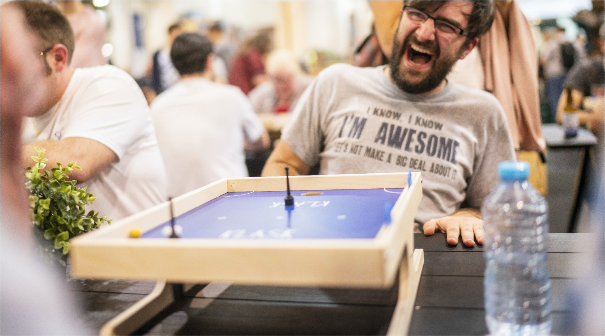
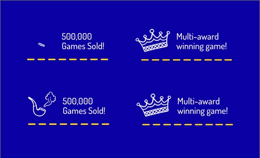
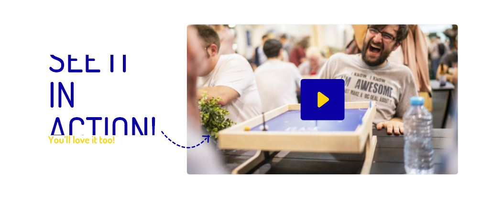

# Klask Demo

by John Meas

Live [Demo](https://klask-demo.myshopify.com/)

## Purpose

This project demonstrates my ability to convert a design file into a frontend template on Shopify. The screen widths that I've focused on are 1680px for desktop and 375px for mobile. I've made sure to handle any layout issues between this range considering that clients might not being viewing on these screen sizes. The large hero text for example has a font size of 108px on large screens and gradually reduces in size till it hits mobile.

## Tools
* Node
* Gulp and PostCSS
* [Tailwind CSS](https://tailwindcss.com/)
* Themekit

note: All javascript libraries were loaded by CDN, I would not do it this way in production.

#### Small Issues

A few elements in this illustration seemed to disappear in the blue background so I took care of it assuming it was supposed to be white.

This large text was getting clipped in the design file, most likely a software issue. I took care of it.

